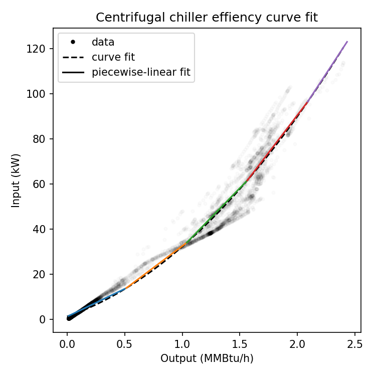

.. _curve_fitting:

Piecewise-Linear Curve Fitting
==============================

A fundamental performance characteristic of many components is 
efficiency: how much output is returned for a given input. 
This mapping is typically noisy, determined both by the component 
design and by physical construction & environmental conditions. 
A good model of component efficiency would thus be nonlinear, 
nonconvex, and likely probabilistic. However, our mixed 
integer-linear program requires linear constraints, so we provide 
methods for data-driven estimation of piecewise-linear 
approximations to efficiency curves.

A piecewise linear curve with k pieces defined on an interval 
is determined by 3k+1 parameters, a slope & intercept for each 
piece along with the knots, the start & end of each segment. 
Note that if we enforce continuity, only a single intercept is 
required.

The agent allows for these parameters to be provided explicitly 
in the config. This default is overridden if training data is 
provided, either loaded from an initial CSV file or queried 
from the historian. In this case, we assume we have a set of 
output-input pairs (we assume the output is the independent 
variable, since this is typically how control is implemented), 
and we estimate the parameters as follows:

1. The data are cleaned in the following ways:
   
   a. If there is not data within a specified proportion of the 
      capacity then training fails.
   b. All records with zero output are discarded. We define the 
      curve on the interval between the minimum output and the 
      capacity. This prevents the component from being “on” with 
      a set point of 0.
   
2. An ansatz (guess at the functional from) is assumed for the 
   curve. Currently only the following choices are implemented. 
   The default is a quadratic polynomial.
   
   a. Polynomial: :math:`y=p_0+p_1 x+⋯+p_N x^N`
   b. A rational function we call “prime mover”: 
      :math:`y=x/(p_0+p_1 x+p_2 x^2 )`
   
3. The parameters of the ansatz are estimated from the data.
   
   a. Polynomials are fit using the common numpy.polyfit 
      least-squares regression. Note that the fit is subject 
      to Runge’s phenomenon (i.e., ringing), especially but 
      not exclusively if the data does not sufficiently cover 
      the domain interval.
   b. The prime mover is fit in a least-squares sense with 
      a custom quadratic program, solved with the cvxopt package. 
      Care is taken to prevent singularities in the domain 
      interval, but this is not guaranteed.
   
4. A fine mesh is defined over the domain interval, and the 
   ansatz with estimated parameters, hereafter called the 
   “curve fit” is evaluated on it.
5. A heuristic is applied to find a fixed number of knot points 
   (the default is 5 pieces, or 4 interior knots):
   
   a. Define an initial error threshold as 50% of the maximum 
      input value in the data.
   b. Find the line through the first and second points in the 
      mesh (that is, the least and second least values of the output).
   c. Calculate the error at the next point: the distance between 
      the value of this line at the next point and the curve fit at 
      the next point.
   d. Repeat (c) until the absolute value of the error is greater 
      than the error threshold. Add the last point with error below 
      the threshold to the list of knots. 
   e. Define a line that goes through that point and the current 
      point as in (b), and repeat over the entire domain interval.
   f. If this process results in a number of knots over the target 
      then reduce the error threshold by a factor of 2; if the 
      number is under the target then increase it by a factor of 2.
   g. Repeat until the desired number of knots is achieved, or a 
      maximum number of iterations is reached.

6. Evaluate the curve fit at the knot points, and define the 
   piecewise-linear curve fit to be made up of the line segments 
   between them.

It is important to note that this process is not optimal: a better 
piecewise-linear approximation may exist to the curve fit, and to 
the underlying data. Finding optimal parameters is a difficult 
problem in general, and this method seems to reach reasonable 
approximations most of the time. However, if we assume that the 
output is convex in the input (a common condition for real 
components) then the problem is considerably more tractable. 
This is left as future work.

Pictured below is an example showing this process. The data (shown
as black dots) are fit with the quadratic curve (dashed line)
which is then approximated with five linear pieces (solid lines).

