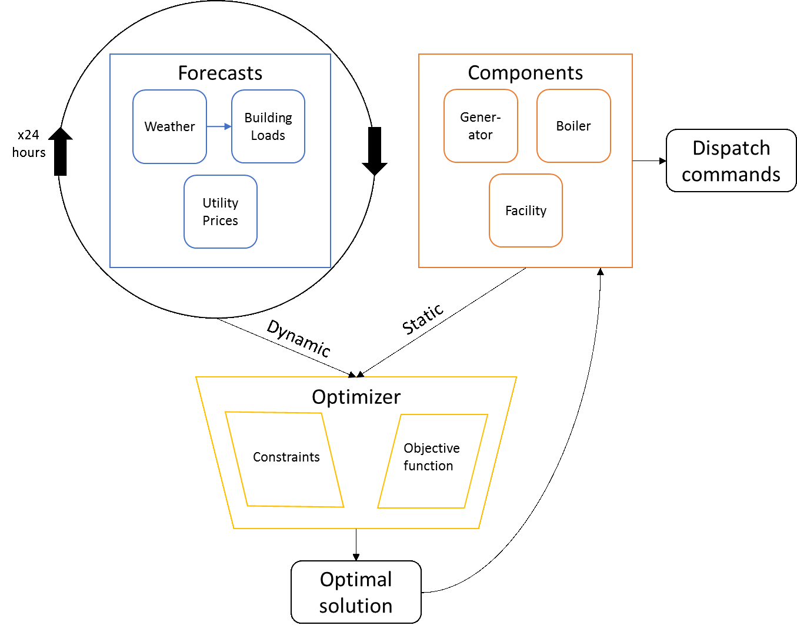
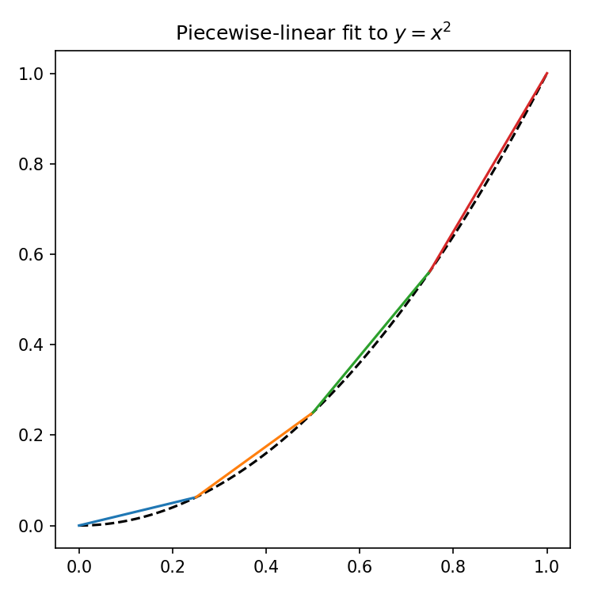

.. _overview:

########
Overview
########

Economic dispatch builds a model of your system in three parts:

1. **Components** model static behavior (i.e., does not change over the optimization window) like:

   * Efficiency
   * Capacity
   * Dispatch constraints like ramp up speed or cycle time

2. **Forecasts** model dynamic behavior (i.e., could change over the optimization window) like:

   * Weather
   * Prices
   * Loads

3. **Optimizers** make decisions:

   * Balance cost and revenue to find optimal setpoints

*************
1. Components
*************

Component models represent the state of different parts of a system, typically
physical components like generators and batteries. They provide *static*
parameters to the optimizer (that is, values which do not change during the
optimization window) via the method ``get_optimization_parameters``.
The base component model (``ComponentBase``) defaults to sending the optimizer
the component's `parameters` parameter, expected to be a ``dict`` containing
relevent parameters.

1.1. Efficiency curves
======================

The behavior of many physical components can be modeled with simple
efficiency curves, where outputs are a function of inputs. Because Economic
Dispatch uses mixed-integer linear programming, these curves must be
piecewise-linear.

1.1.1. Data Format
------------------

A convenient format to pass such curves between component models and
optimizers is as a dict of parameters::

   fundata = {'a': [0.25, 0.75, 1.25, 1.75],
              'b': [0., -0.125, -0.375, -0.75],
              'xmin': [0., 0.25, 0.5, 0.75],
              'xmax': [0.25, 0.5, 0.75, 1.]}

which defines an piecewise-linear approximation in four pieces to
:math:`y = x^2` on :math:`x \in [0, 1)` where :math:`y_i = a_i x + b_i` for
:math:`x \in [xmin_i, xmax_i)`.

An efficiency curve in this format can easily be passed to the component as a
default parameter in the config, and then from the component to the optimizer.

1.1.2. Curve Fitting
--------------------

Economic Dispatch includes the ability to fit such a curve directly to
operational data from the physical component: given a CSV file containing
measurements of input and output (see ``preprocessing`` for help with parsing
data files), the utility function ``piecewise_linear`` will fit a continuous
curve to the data, then find a close piecewise-linear approximation to that
curve. Read more at :ref:`curve_fitting`.

1.1.3. Data format and preprocessing
------------------------------------

Training data may come in raw form. Rather than writing many component 
models which differ only in how they preprocess training data, we provide 
a unified preprocessor capable of common transformations. It performs the 
following operations, in order:

1. Convert local timestamps to UTC
2. Rename variables
3. Form linear combinations of variables (including adding a constant)
4. Multiply variables together
5. Enforce lower and possibly upper bounds
6. Throw out unused variables

How to specify settings for each step is defined in the documentation 
for `utils.preprocess` 

1.2. Behavior constraints and activity prices
=============================================

The ``IOComponent`` includes other parameters to be passed to the optimizer:

* Ramp-up and -down: limit how fast the component can change setpoints
* Lock-on and -off: prevent the component from turning off and on too quickly
* Start and run costs: the cost to start-up or run the component, to represent
  maintenance costs

1.3. Other behavior
===================

The component models can represent more complex functionality, too.

* The ``battery`` and ``thermal_storage`` components show how to
  implement components which take feedback from the physical device at each
  timestep to update a paramter, like a battery's state of charge.

************
2. Forecasts
************

Forecast models represent inputs to a system, typically utility prices and 
building loads. They provide dynamic parameters to the optimization (that 
is, values which change during the optimization window). Some examples include:

- utility prices: queried from an API or read from a data file
- weather: queried from an API or read from a data file
- cooling, heating, electric, or other loads: read from a data file or predicted 
  based on weather and time information

We provide an example of querying an API, reading from a CSV, and predicting using
either the common SciKit-Learn package, or with our own k-nearest neighbors-based 
method. We also provide a forecast that repeats its default settings at each timestep.

Weather forecasts are handled separately, as they set the horizon of the optimization
window. We provide examples for empty weather forecasts (only timestamps), as well as
a CSV-based "historical forecast" and a method to query the National Weather Service for
free and up-to-date weather forecasts.

*************
3. Optimizers
*************

The dispatch set points are optimized for lowest cost of meeting loads for some 
time horizon (defined by the weather forecast) based on the forecasted load, 
utility pricing, and component parameters. A mixed integer-linear programming 
method (implemented in the PuLP package, available on PyPI) is used to calculate 
cost based on component efficiency, startup and fixed operational costs, and 
the price of component inputs like electricity and gas. See Section 3 for 
details.

This functionality is implemented via a function which accepts forecasts 
and component parameters and returns a solution to an optimization problem. 
A wrapper ``get_pulp_optimization_function`` can be used to adjust the solver 
settings within PuLP and (optionally) write full representations of the 
problem to a file.

An example optimization is provided, but not described in detail here.
